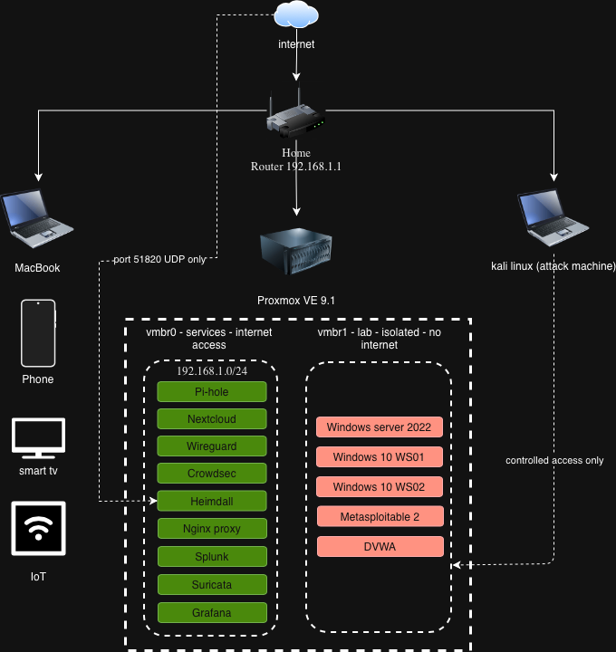

# Homelab

A self-hosted homelab built on Proxmox VE for learning
penetration testing and SIEM, also running privacy-focused personal
services. Built from scratch on a budget Dell desktop PC.

## Hardware
| Machine       | Role                  | OS              |
|---------------|-----------------------|-----------------|
| Dell i5 PC  | Proxmox server        | Proxmox VE 9.1  |
| Kali linux laptop | Attack machine        | Kali Linux      |
| MacBook       | Management and ops    | macOS           |

## Infrastructure
- Hypervisor: Proxmox VE 9.1
- Storage: 931GB HDD (794GB available for VMs)
- Network: Two virtual bridges 
(vmbr0 for services, vmbr1 for isolated lab)

## Network Diagram

## Services
| Service           | Purpose                        |
|-------------------|--------------------------------|
| Pi-hole           | Network-wide DNS ad blocker    |
| Nextcloud         | Self-hosted Drive              |
| WireGuard         | VPN for remote access          |
| Crowdsec          | Active threat blocking         |
| Uptime Kuma       | Service uptime monitoring      |
| Heimdall          | Services dashboard             |
| Nginx Proxy Mgr   | Reverse proxy and SSL          |
| Splunk            | SIEM                           |
| Suricata          | Network Security Monitor       |
| Grafana           | Visual dashboards              |
| duckDNS           | Hosts my domain                 |

## Lab Environment
| Machine              | Purpose                         |
|----------------------|---------------------------------|
| Windows Server 2022  | Active Directory domain controller|
| Windows 10 x2        | Domain-joined workstations      |
| Metasploitable 2     | Vulnerable Linux target         |
| DVWA                 | Vulnerable web application      |

## Skills Demonstrated
- Hypervisor administration (Proxmox KVM and LXC)
- Linux system administration and hardening
- Network design and segmentation
- Active Directory deployment and attack simulation
- Self-hosted service deployment
- Security monitoring and firewall configuration
- VPN configuration and remote access
- Technical documentation

## Progress
- [x] Proxmox VE 9.1 installed and configured
- [x] Repository hardening completed
- [x] System updated
- [x] Network isolation configured
- [x] Firewall configured
- [ ] LXC services deployed
- [ ] Lab VMs deployed
- [ ] WireGuard VPN configured
- [ ] Security assessment completed

## Documentation
- proxmox/setup.md — installation and configuration
- proxmox/issues-log.md — problems encountered and fixes
- proxmox/storage.md — storage layout
- proxmox/firewall.md — firewall rules
- proxmox/hardening.md — security hardening steps
- network/network-map.md — full network diagram
- services/ — individual service documentation
- lab-vms/ — lab environment documentation
- security-assessment/ — penetration test findings